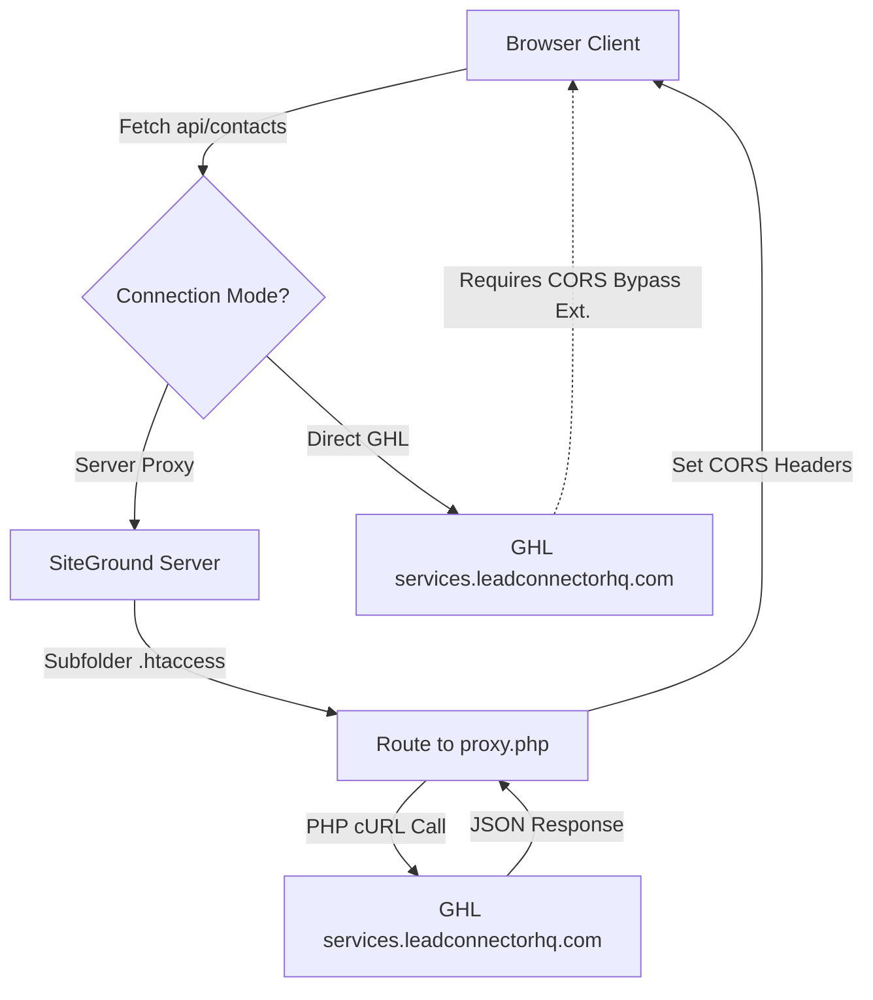

# 📝 Troubleshooting & Resolution Guide: GHL API Proxy on SiteGround Shared Hosting

This document provides a detailed breakdown of the proxy issue encountered when deploying the GoHighLevel (GHL) Platform API Dashboard to a live SiteGround shared hosting server, the code modifications made, and how the architecture solves these problems for future reference.

---

## 🔍 1. What was the Issue? (The 3 Core Problems)

When deploying the production build (`dist/` folder) to your live server (`https://instantquoteform.com`), the API requests failed with **404 Not Found** errors. This was caused by three overlapping issues:

### ⚠️ Problem A: Browser CORS (Cross-Origin Resource Sharing)
*   **The Cause:** Web browsers enforce security restrictions that prevent JavaScript running on one domain (e.g., `https://instantquoteform.com`) from sending HTTP requests directly to a different domain (e.g., `https://services.leadconnectorhq.com`) unless the receiving server responds with permission headers (`Access-Control-Allow-Origin`).
*   **The GHL Aspect:** The GoHighLevel Platform API is designed for server-to-server integrations. It does not permit direct browser calls from custom domains and returns CORS block errors when attempted directly.

### ⚠️ Problem B: Apache `mod_proxy` is Disabled on Shared Hosting (SiteGround)
*   **The Cause:** In development, Vite runs a local Node.js proxy server. In production, standard static hosts have no proxy server running.
*   **The Attempted Fix:** A native Apache rewrite rule was added to `.htaccess` using the `[P]` (Proxy) flag:
    ```apache
    RewriteRule ^api/(.*)$ https://services.leadconnectorhq.com/$1 [P,L]
    ```
*   **The Failure:** SiteGround, Bluehost, HostGator, and almost all shared hosting providers **disable Apache's `mod_proxy` module** for security reasons (to prevent their servers from being hijacked as open proxies). Without this module, the `[P]` flag fails, and Apache throws a **404 Not Found** or a silent redirect error.

### ⚠️ Problem C: Subdirectory Pathing Mismatch (`/api` vs `api`)
*   **The Cause:** The React dashboard app originally sent API requests to `/api/...` (with a leading slash). 
*   **The Failure:** When the dashboard was uploaded into a subdirectory (e.g., `https://instantquoteform.com/ghl-api/`), the browser resolved `/api/...` back to the absolute root domain (`https://instantquoteform.com/api/...`), completely bypassing the subfolder. 
*   **The Interception:** The main website running at the root (like WordPress or another system) caught this request, saw that `/api` did not exist in WordPress, and returned the main website's custom **404 Page** (which was returned in the browser Network preview tab).

---

## 🛠️ 2. What We Updated & Resolved

To solve all three problems dynamically, we implemented a hybrid client-relative and server-side PHP routing proxy:



### 1. Created a PHP Proxy Backend ([`proxy.php`](./public/proxy.php))
Instead of relying on Apache's disabled `mod_proxy` module, we wrote a lightweight PHP script placed inside the `public/` folder.
*   **How it works:** It acts as a middleware. The frontend calls `proxy.php`, which intercepts the call, reads the target path (e.g. `contacts/`), forwards all necessary query parameters and headers (like `Authorization` and `Version`), performs a cURL connection to `https://services.leadconnectorhq.com`, and outputs the response back to the browser.
*   **CORS Handling:** The PHP script injects the correct CORS headers (`Access-Control-Allow-Origin: *`) back into the browser response, bypassing GHL's cross-origin blocking.

### 2. Formulated Subdirectory-Compatible Rewrites ([`.htaccess`](./public/.htaccess))
We modified the Apache `.htaccess` rules inside the `public/` directory:
*   **No Absolute Conds:** Removed `RewriteCond %{REQUEST_URI} ^/api/` which broke in subdirectories.
*   **Relative Rewrite:** Configured `RewriteRule ^api/(.*)$ proxy.php?route=$1 [QSA,L]` to forward all requests starting with `api/` relative to the current directory to `proxy.php`.
*   **Authorization Header Guard:** Added environment overrides (`SetEnvIf` equivalent) to prevent Apache from stripping out the critical `Authorization: Bearer <Token>` header, which it typically does for FastCGI PHP processes:
    ```apache
    RewriteCond %{HTTP:Authorization} ^(.*)
    RewriteRule .* - [E=HTTP_AUTHORIZATION:%1]
    ```

### 3. Converted Client Paths to Relative ([`ghlApi.js`](./src/api/ghlApi.js))
*   **What changed:** Replaced the default base path from absolute `/api` to relative `api` (no leading slash).
*   **Benefit:** If the React dashboard is loaded at `https://domain.com/folder/index.html`, calling `api/...` targets `https://domain.com/folder/api/...` instead of jumping back to the domain root.

### 4. Added UI Connection Mode Toggle ([`App.jsx`](./src/App.jsx))
We introduced a connection mode dropdown (`🌐`) inside the top credential bar:
*   **Server Proxy (`api`):** Uses the relative local PHP proxy (Default, recommended for production).
*   **Direct GHL Connection (`https://services.leadconnectorhq.com`):** Bypasses the server proxy entirely, allowing users to call GHL directly from their browser if they run a browser CORS extension (such as "Allow CORS").

---

## 📝 3. Summary of File Modifying Changes

### [`public/proxy.php`](./public/proxy.php)
*   Handles parsing, request mapping, forwarding HTTP methods (`GET`, `POST`, `OPTIONS`), cURL requests, custom Bearer headers, and writing back output stream.

### [`public/.htaccess`](./public/.htaccess)
*   Prevents header stripping and rewrites relative `api/*` calls into `proxy.php?route=*`.

### [`src/api/ghlApi.js`](./src/api/ghlApi.js)
```diff
-const BASE = '/api';
+const BASE = {
+  toString: () => sessionStorage.getItem('ghl_api_base') || 'api'
+};
```

### [`src/App.jsx`](./src/App.jsx)
*   Added `apiBase` hook state synced with `sessionStorage`.
*   Rendered a dropdown menu (`🌐`) in the header bar which locks configuration once connected.

---

## 💡 Lessons for Next Time (How to Solve This Else)

When deploying any frontend-only React/Vue/Angular dashboard that consumes external APIs to a shared host (SiteGround, GoDaddy, Hostinger, Bluehost):

1.  **Never use absolute paths** (like `/api`) in API request endpoints if you plan to host the build files inside subdirectories. Always use relative paths (`api`) or configure a base domain URL.
2.  **Do not rely on Apache `[P]` (Proxy Redirects)** on shared hosting. It will result in a 404 because `mod_proxy` is deactivated for security.
3.  **Deploy a PHP Proxy Wrapper:** Create a simple 80-line PHP cURL proxy next to your `index.html` (inside the `public/` directory so Vite packages it during build) to act as the server-side router.
4.  **Save the Authorization Header:** Remember that Apache running PHP on FastCGI strips the `Authorization` header by default. Always include the RewriteRule override in `.htaccess` to map `HTTP_AUTHORIZATION` manually to the PHP context.
